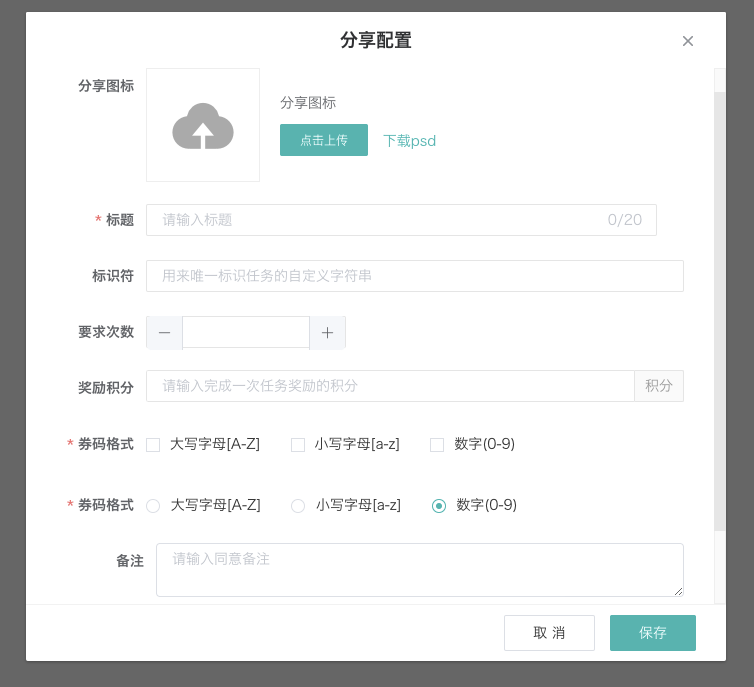

---
nav:
  title: duiba-dev-new
  order: 1
group:
  title: 高级组件
  order: 4
title: FormDialog弹窗
order: 1
---

# db-form-dialog

操作性弹窗,带有表单项的弹窗

组件源码： [http://gitlab2.dui88.com/frontend/duiba-dev-new/blob/master/refactor/dev-new-refactor/src/components/BusinessDialog/FormDialog.vue](http://gitlab2.dui88.com/frontend/duiba-dev-new/blob/master/refactor/dev-new-refactor/src/components/BusinessDialog/FormDialog.vue)

## 使用方法

表单栏由传入的 formConfig 渲染而成

```html
<div>
  <db-button @click="handleOpen">开启弹窗</db-button>
  <db-form-dialog
    title="分享配置"
    confirmButtonText="保存"
    width="500px"
    label-width="90px"
    :visible="visible"
    :form-config="formConfig"
    :form-init-data="formInitData"
    :modal="modal"
    @confirm="handleConfirm"
    @close="handleClose"
  />
</div>

```

```html
  <db-form-dialog
    title="分享配置"
    confirmButtonText="保存"
    width="500px"
    label-width="90px"
    :visible="visible"
    :form-config="formConfig"
    :form-init-data="formInitData"
    :modal="modal"
    @confirm="handleConfirm"
    @close="handleClose"
  />
```

```js
<script>
  new Vue({
    el: '#main',
    data: {
      visible: false,
      modal: true,
      formInitData: {
        shareIconUrl: '',
        shareTitle: '',
        shareSubTitle: ''
      },
      formConfig: formConfig: [
        { label: '分享图标', type: 'image-upload', prop: 'shareIconUrl', props: defaultImgProps },
        {
          label: '标题',
          prop: 'shareTitle',
          type: 'db-limit-input',
          rules: requireRule2,
          props: { style: 'width:95%;', maxLength: 20, placeholder: '请输入标题' }
        },
        {
          label: '标识符',
          type: 'input',
          prop: 'taskIdentifier',
          props: { placeholder: '用来唯一标识任务的自定义字符串' }
        },
        { label: '要求次数', type: 'el-input-number', prop: 'requireLimit', props: { min: 1, max: 99 } },
        {
          label: '奖励积分',
          type: 'input',
          prop: 'rewardCredits',
          props: { placeholder: '请输入完成一次任务奖励的积分', maxLength: 6 },
          slotAppend: '积分'
        },
          {
          label: '券码格式',
          prop: 'couponStyle',
          type: 'check-group',
          options: typeOptions,
          textKey: 'text',
          labelKey: 'label',
          valueKey: 'value',
          rules: requireRule2
        },
          {
          label: '券码格式',
          prop: 'couponStyle2',
          type: 'radio-group',
          options: typeOptions,
          textKey: 'text',
          labelKey: 'label',
          valueKey: 'value',
          rules: requireRule2
        },
        { label: '备注', labelWidth: '100px', prop: 'text', type: 'textarea', placeholder: '请输入同意备注' },
        {
          label: '任务时间',
          type: 'el-date-picker',
          prop: 'dateRange',
          noRule: true,
          keyMapper: ['startDate', 'endDate'],
          props: { type: 'datetimerange', valueFormat: 'timestamp', size: 'small' }
        },
      ...
      ]
    },
    methods: {
      handleOpen(){
        this.visible = true;
      },
      handleConfirm(params){
        console.log(params)
      },
      handleClose() {
        console.log('close')
      }
    }
  })
</script>
```

## [效果预览](https://hd.dlp.duiba.com.cn/static/index/new?appId=1#/example?active=3)

预览效果源码 [http://gitlab2.dui88.com/frontend/duiba-dev-new/tree/master/refactor/dev-new-refactor/src/views/example/components/demo-dialog.vue](http://gitlab2.dui88.com/frontend/duiba-dev-new/tree/master/refactor/dev-new-refactor/src/views/example/components/demo-dialog.vue)



## 组件属性

参数|说明|类型|可选值|默认值
:---:|:--:|:---:|:---:|:---:
visible|	控制是否显示|	boolean|	true/false|	-
value/v-model|	等同vsible|	boolean|	true/false|	-
title|	弹窗标题|	string|	-|	添加
width|	弹窗宽度|	string|	-|	450px
labelWidth|	表单的标签(label)宽度|	string|	-|	120px
cancelButtonText|	取消按钮文案|	string|	-|	取 消
confirmButtonText	确认按钮文案	string	-|	确 定
formInitData|	表单初始值|	object|	-|	{}
formConfig|	表单配置项|	array|	-|	[]
autoPlaceholder|	根据配置项的label自动截取placeholder|	boolean|	true/false|	-
modal|	是否显示遮罩层|	boolean|	true/false|	true


## formConfig

参数|说明|类型|可选值|默认值
:---:|:--:|:---:|:---:|:---:
label|	表单标签|	string|	——|	——
prop|	表单域 model 字段，在使用 validate、resetFields 方法的情况下，该属性是必填的|	string|	——|	——
rules|	表单验证规则，具体规则见element-ui中form组件说明|	object|	array|	——
show|	表单项显示控制函数，无时默认显示，参数为表单值集合|	funtion|	——|	——
type|	组件类型，具体见[dynamic-component](/duiba-dev-new/advanced/dynamic-component)|	string|	——|	——


## slot

插槽名称|说明
:---:|:--:
tips|	顶部文案显示区域
默认插槽|	表单项
foooter|	底部按钮显示控制

