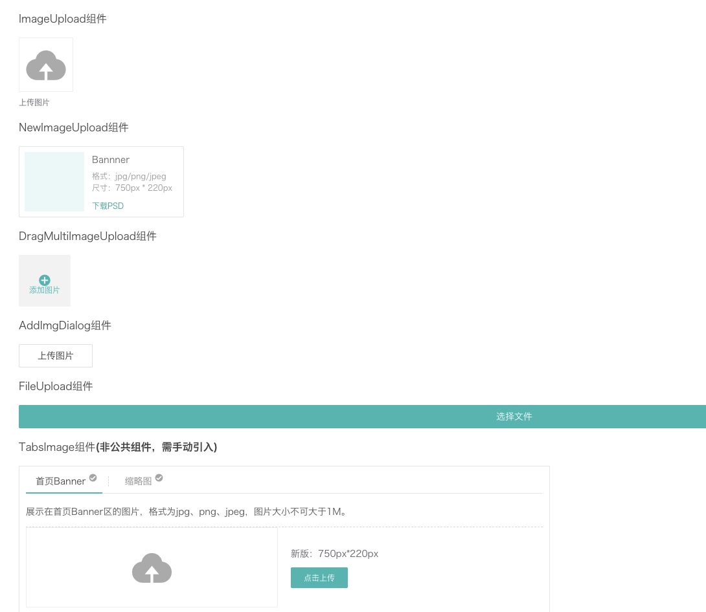

---
nav:
  title: duiba-dev-new
  order: 1
group:
  title: 高级组件
  order: 4
title: ImageUpload图片上传
order: 5
---

# ImageUpload图片上传

element-ui上传组件el-upload二次封装

组件源码： [http://gitlab2.dui88.com/frontend/duiba-dev-new/blob/master/refactor/dev-new-refactor/src/components/FormItem/Upload/ImageUpload.vue](http://gitlab2.dui88.com/frontend/duiba-dev-new/blob/master/refactor/dev-new-refactor/src/components/FormItem/Upload/ImageUpload.vue)

### 使用方法

```html
<image-upload
 :value="params.imageUrl"
 :limit="params.limit"
 :tip="params.tip"
 :show-btn="false"
 @input="handleImageChange"
/>
```

## [效果预览](https://hd.dlp.duiba.com.cn/static/index/new?appId=1#/example?active=4)

预览效果源码 [http://gitlab2.dui88.com/frontend/duiba-dev-new/tree/master/refactor/dev-new-refactor/src/views/example/components/demo-image-upload.vue](http://gitlab2.dui88.com/frontend/duiba-dev-new/tree/master/refactor/dev-new-refactor/src/views/example/components/demo-image-upload.vue)



## 组件属性

参数|说明|类型|可选值|默认值
:---:|:--:|:---:|:---:|:---:
value/v-model|	绑定的值|	string|	-|	-
limit|	上传限制|	object|	-|	-
showTip|	是否展示上传文案|	boolean|	true/false|	true
showImg|	是否展示上传图片|	boolean|	true/false|	true
showBtn|	是否展示上传按钮|	boolean|	true/false|	true
tip|	上传文案|	string|	-|	-
uploadButtonType|	上传按钮的type值，具体参考element-ui的button|	string|	-|	primary
action|	上传接口|	string|	-|	/upload/image
placeholderIcon|	上传图标icon，具体参考element-ui的Icon|	string|	-|	el-icon-upload
placeholderImg|	效果等同placeholderIcon，不过该属性需要输入图片的url地址|	string|	-|	-
horizontal|	图片和文案| 水平展示|	boolean|	true/false|	false
imgHeight|	图片的高度|	string｜number|	-	|-
imgWidth|	图片的宽度|	string｜ number|	-|	-
showLoading|	是否展示loading，作用于指令| v-loading|	boolean|	true/false|	-
suggestSize|	校验图片尺寸和大小|	boolean|	true/false|	false
urlPathKey|	上传接口返回的图片字段的key|	string|	-	|url
multiple|	是否支持多选文件|	boolean|	true/false|	false
imageList|	上传的文件列表, 例如: [{name: 'food.jpg', url: 'https://xxx.cdn.com/xxx.jpg'}]|	array|	-|	-
disabled|	是否禁用|	boolean|	true/false|	-
psdurl|	图片psd下载地址|	string|	-|	-
index|	如果是列表，传入索引|	number|	-	|-

## 事件

事件名称|说明
:---:|:--:
loading|	loading显示区域
img|	图片显示区域
tip|	上传文案显示区域
btn|	上传按钮显示区域
