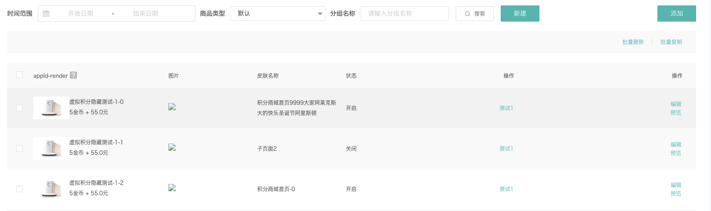

---
nav:
  title: duiba-dev-new
  order: 1
group:
  title: 高级组件
  order: 4
title: ListPage
order: 4
---

# list-page（简单表单页面组件）

带有表单项的表格，考虑到部分表单页面的构成较为简单一致，基本分为搜索栏、表单栏、分页栏三部分，代码重复率很高，为节约开发维护成本故抽取出此组件。较为简单的表单展示页面推荐使用此组件。

较为简单的表单展示页面推荐使用此组件。

组件源码： [http://gitlab2.dui88.com/frontend/duiba-dev-new/blob/master/refactor/dev-new-refactor/src/components/ListPage/index.vue](http://gitlab2.dui88.com/frontend/duiba-dev-new/blob/master/refactor/dev-new-refactor/src/components/ListPage/index.vue)


## 基础使用
搜索栏由传入的 formConfig 渲染而成。
```js
formConfig: [
  {
    label: '时间范围',
    prop: 'date',
    type: 'daterange',
    keyMapper: ['startDate', 'endDate'],
    'picker-options': {
      disabledDate: time => {
        return time.getTime() >= Date.now() - 24 * 60 * 60 * 1000;
      }
    },
    change: value => {
      console.log(value);
    }
  },
  {
    label: '商品类型',
    prop: 'itemType',
    type: 'select',
    options: [{ value: '', label: '默认' }, { value: 'object', label: '实物' }]
  },
  {
    label: '分组名称',
    prop: 'name',
    type: 'input',
    placeholder: '请输入分组名称'
  }
  ...
]
```
表单配置
```js
columns: [
  {
    label: 'appId-render',
    prop: 'appId',
    width: 300,
    tip: '1222',
    render(h, { row, $index }) {
      return (
        <div class="test-wrap">
          
          <div>
            <p>
              虚拟积分隐藏测试-{row.appId}-{$index}
            </p>
            <p>5金币 + 55.0元</p>
          </div>
        </div>
      );
    }
  },
  { label: '图片', prop: 'jsUrl', type: 'img' },
  { label: '皮肤名称', prop: 'skinName' },
  { label: '状态', prop: 'openStatus', formatter: ({ openStatus }) => (openStatus ? '开启' : '关闭') }
  ...
]
```
按钮配置
```js
// 搜索框底部按钮配置
  btnList: [
    { text: '批量删除', handleClick: this.handleBtnClick, show: () => true },
    { text: '批量上架', handleClick: this.handleBtnClick, show: () => false },
    { text: '批量复制', handleClick: this.handleBtnClick },
    ...
 ],
// 表格操作项按钮配置 
actionBtns: [
    { text: '编辑', action: this.handleBtnClick },
    { text: '预览', action: this.handleBtnClick },
    ...
]
```
```html
<db-list-page
  request-type="visualEditorSkinsList"
  :form-data="{ appId, includeIndex: true }"
  :page-props="{ total: 'totalCount', pageNo: 'pageNo', list: 'result' }"
  show-checkbox
  searchBtnType="ghost"
  :form-config="formConfig"
  :columns="columns"
  @selection-change="listSelectChange"
  :action-btns="actionBtns"
  @action-btn-click="handleActionBtnClick"
  :handle-btns="btnList"
>
  <template slot="right-btns">
    <el-button type="primary">添加</el-button>
  </template>
  <template slot="columns">
    <el-table-column label="操作" align="right">
      <template slot-scope="{ row }">
        <el-button size="mini" type="text">测试1</el-button>
      </template>
    </el-table-column>
  </template>
</db-list-page>
```

## 非靠右新增按钮
```html
<db-list-page
  :form-init-data="form"
  request-type="agentChargeList"
  :form-config="formConfig"
  :tabs="tabs"
  tab-key="state"
  :columns="columns"
  searchBtnType="ghost"
  >
  <template slot="btns">
    <el-button type="primary" @click="showDialog">新建充值</el-button>
  </template>
  <template slot="columns">
    ...
  </template>
</db-list-page>
```

## 无搜索
```html
<db-list-page
  request-type="getSigninContractList"
  :columns="columns"
  ref="list"
  >
  <template slot="right-btns">
    <el-button type="primary" @click="goEditPage()">契约签到</el-button>
  </template>
  <template slot="columns">
    ...
  </template>
</db-list-page>
```


## [效果预览](https://hd.dlp.duiba.com.cn/static/index/new?appId=1#/example?active=3)

预览效果源码 [http://gitlab2.dui88.com/frontend/duiba-dev-new/tree/master/refactor/dev-new-refactor/src/views/example/components/demo-list-page.vue](http://gitlab2.dui88.com/frontend/duiba-dev-new/tree/master/refactor/dev-new-refactor/src/views/example/components/demo-list-page.vue)



## 组件属性
参数|说明|类型|可选值|默认值
:---:|:--:|:---:|:---:|:---:
requestType|列表请求的类型，相关url对应的字段，无需指定请求方式，由请求函数通过url定义的方式自行判断|string|——|必填
requestConfig|请求配置，会并入请求函数的第三个参数，使用请参考请求封装的函数|object|——|——
title|弹窗标题|string|——|'添加'
formInitData|表单初始值|object|——|——
formData|请求额外值，会在请求时加上|object|——|——
formConfig|表单配置，具体配置见下表|array|——|必填
tabs|tab栏配置|array，[{ txet, key值字段（由tabKey指定） }]|——|——
tabKey|tab栏的key值|string|——|——
columns|表格配置，具体配置见下表|array|——|——
searchBtnText|搜索按钮文本|string|——|'搜索'
searchBtnType|搜索按钮类型|string|primary / success / warning / danger / info / text|'primary'
search|搜索函数，如非必要不推荐使用|Function，参数form表单值|——|——
formateRequestData|格式化搜索数据|function|——|（form）=> form
pageProps|分页相关字段|{pageNo, pageSize, total }|——|——
showPage|是否显示分页信息|boolean|true/false|true
showCheckbox|是否显示多选|boolean|true/false|false
handleBtns|操作栏配置|Array，[{text, handleClick}]|-|-


## formConfig
参数|说明|类型|可选值|默认值
:---:|:--:|:---:|:---:|:---:
label|表单标签|string|——|——
prop|表单域 model 字段，在使用 validate、resetFields 方法的情况下，该属性是必填的|string|——|——
rules|表单验证规则，具体规则见element-ui中form组件说明|object|array|——|——
show|表单项显示控制函数，无时默认显示，参数为表单值集合|funtion|——|——
type|组件类型，具体见[dynamic-component](/duiba-dev-new//basic/dynamic-component)|string|——|——

其余属性见[dynamic-component](/duiba-dev-new//advanced/dynamic-component)说明

## columns
表格配置

参数|说明|类型|可选值|默认值
:---:|:--:|:---:|:---:|:---:
label|显示的标题|string|——|——
prop|对应列内容的字段名，也可以使用 property 属性|string|——|——
render|渲染函数|function(h, params({row,column,$index}))|——|——
fomatter|格式化函数|function|——|——
type|组件类型，具体见[dynamic-component](/duiba-dev-new//advanced/dynamic-component)|string|——|——


其余属性会全部渲染到table-column组件中


## slot

插槽名称|说明
:---:|:--:
search-btn|	搜索按钮模块的显示
left-btns|	搜索栏form-config左侧的部分
btns|	搜索栏form-config右侧的部分
right-btns|	搜索栏靠右的模块
other-tips|	搜索栏底部的模块
columns|	表格项除了配置的columns外的部分

