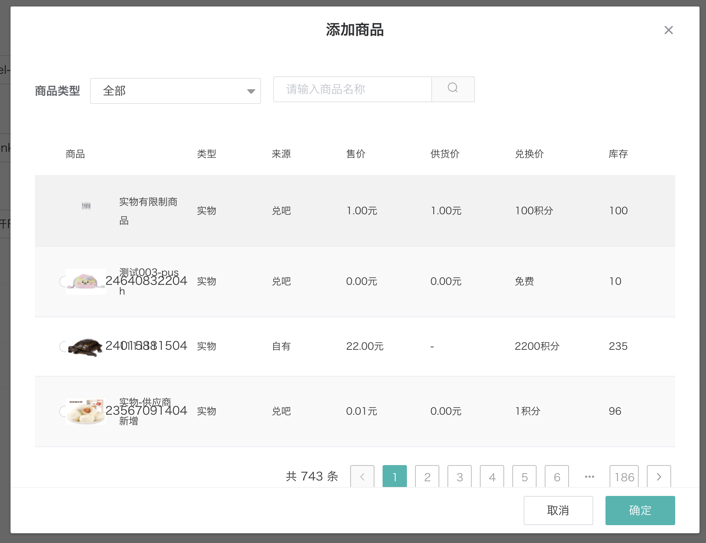

---
nav:
  title: duiba-dev-new
  order: 1
group:
  title: 高级组件
  order: 4
title: SelectGoods选择商品
order: 6
---

# SelectGoods选择商品

很多场景都需要选择商品，选择秒杀商品、会员商品、


组件源码： [http://gitlab2.dui88.com/frontend/duiba-dev-new/blob/master/refactor/dev-new-refactor/src/views/creditShop/marketing-tool/vipgoods/components/selectCustomGoods.vue](http://gitlab2.dui88.com/frontend/duiba-dev-new/blob/master/refactor/dev-new-refactor/src/views/creditShop/marketing-tool/vipgoods/components/selectCustomGoods.vue)

### 使用方法

```html
<select-custom-goods
  :visible.sync="dialogVisible"
  @select="handleGoodsInput"
  :goods-id="form.itemIds"
/>
```

## [效果预览](https://hd.dlp.duiba.com.cn/static/index/new?appId=1#/example?active=2)

预览效果源码 [http://gitlab2.dui88.com/frontend/duiba-dev-new/tree/master/refactor/dev-new-refactor/src/views/example/components/demo-dialog.vue](http://gitlab2.dui88.com/frontend/duiba-dev-new/tree/master/refactor/dev-new-refactor/src/views/example/components/demo-dialog.vue)



## 组件属性

参数|说明|类型|可选值|默认值
:---:|:--:|:---:|:---:|:---:
visible|	是否显示弹窗|	boolean|	true/false|	false
goodsId|	选中的商品Id|	string|	-|	-
